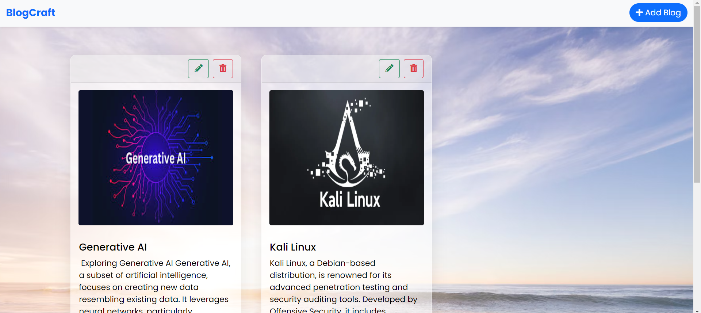
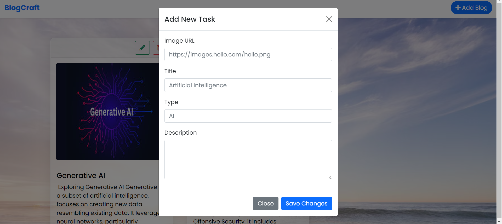
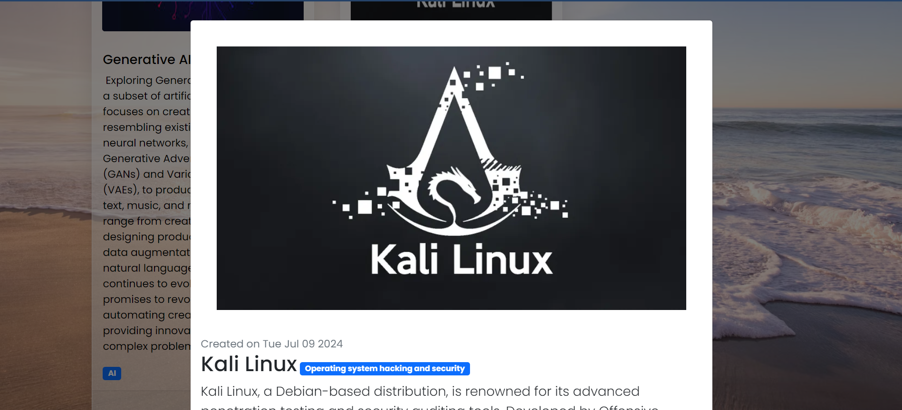

# Blog Application

## Description

A Blog Application is a platform where users can create, edit, delete, and view blogs. This application utilizes LocalStorage for persistent data storage, ensuring that user-generated content remains intact even after the browser is closed. This functionality guarantees that blog entries are available and can be accessed whenever the user returns to the application.

## Stacks Used
* HTML & CSS
* Bootstrap - A CSS Framework
* JavaScript -> LocalStorage

## Use of Project

To comprehend the concept of LocalStorage, it's important to understand how it persists data. LocalStorage stores data with no expiration date, meaning that the information remains intact even when the browser tab is closed or the page is refreshed. This ensures that the data is available and can be accessed whenever the user returns to the page.

## ScreenShot

Click on the `Add New`, UI looks like:

Click on the `Open Blog`, UI looks like:

## Live Demo

